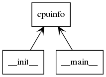
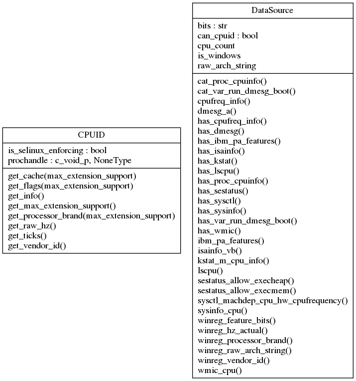

# Python Linters

It's probably a best practice to use linters, __especially__ with interpreted languages. By which I mean javascript,
node.js, PHP or Python (and probably others).

If you are a beginner linters will generally catch any ___n00b___ errors - which will probably save everyone some
time and/or embarrassment. And for most people they will often catch potential problems that were not spotted. For
anyone who frequently uses different languages, they suggest a style and idiom appropriate for the language. Often
these seem to be very minor things - but they may have specific meanings in any particular language. For instance,
whether or not a variable or function is __capitalised__ can be significant - but often it will simply be such
useful suggestions as using underscores instead of hyphens, and whether or not camel-case is appropriate.

All in all, it's generally a best practice to keep code as idiomatic as possible. And linters are great for this.

Here I am trying out [pycodestyle](http://pycodestyle.pycqa.org/en/latest/), [pylint](https://www.pylint.org/),
[pydocstyle](https://github.com/PyCQA/pydocstyle), and [Black](https://github.com/psf/black).

`pycodestyle` and `pylint` are ___code linters___ whereas `pydocstyle` is a ___documentation linter___.

`Black`, on the other hand, is a ___code formatter___ (along the lines of `gofmt`). These can reduce the pain
of ___code reviews___ as there are fewer arguments about the proper way of formatting code to ensure ___readability___.
Also, one of Black's claims is that:

> _Black_ makes code review faster by producing the smallest diffs possible.

[Which sounds pretty useful.]

## Contents

The contents are as follows:

* [pycodestyle](#pycodestyle)
    * [Installing pycodestyle](#installing-pycodestyle)
    * [Verify pycodestyle version](#verify-pycodestyle-version)
    * [Running pycodestyle](#running-pycodestyle)
* [pylint](#pylint)
    * [Installing pylint](#installing-pylint)
    * [Verify pylint version](#verify-pylint-version)
    * [Running pylint](#running-pylint)
    * [pyreverse](#pyreverse)
* [An example of using `pylint` and `pycodestyle`](#an-example-of-using-pylint-and-pycodestyle)
* [pydocstyle](#pydocstyle)
    * [Installing pydocstyle](#installing-pydocstyle)
    * [Verify pydocstyle version](#verify-pydocstyle-version)
    * [Running pydocstyle](#running-pydocstyle)
* [An example of using `pydocstyle`](#an-example-of-using-pydocstyle)
* [Black](#black)
    * [Installing Black](#installing-black)
    * [Verify Black version](#verify-black-version)
    * [Running Black](#running-black)
* [To Do](#to-do)

## pycodestyle

This is probably the linter to use, specifically for the `PEP 8` integration.

In fact, it was formerly called `pep8`.

However, I still like [pylint](#pylint) quite a lot, for one thing it will complain if a file is not named in a
Pythonic way. And they've gamified `pylint` pretty well, it's oddly satisfying to clean up formatting and see the
code score improve.

#### Installing pycodestyle

Run the following command:

    $ pip3 install --user pycodestyle

#### Verify pycodestyle version

Verify the version as follows:

    $ pycodestyle --version

#### Running pycodestyle

Run `pycodestyle` as follows:

    $ pycodestyle xxxxx.py

Limit `pycodestyle` to the first occurrence of each linting error:

    $ pycodestyle --first xxxxx.py

Show the offending source code and the relevant text from PEP 8:

    $ pycodestyle --show-source --show-pep8 xxxxx.py

## pylint

I'm kind of a sucker for UML and pylint ships with an interesting-looking tool ([pyreverse](#pyreverse))
which I wanted to try out.

For anyone preparing to migrate code from Python 2 to Python 3, `pylint` will highlight potential problem areas.

#### Installing pylint

Run the following command:

    $ pip3 install --user pylint

#### Verify pylint version

Verify the version as follows:

    $ pylint --version

#### Running pylint

Run `pylint` as follows:

    $ pylint xxxxx.py

For any obsessive-compulsives, `pylint` provides a code score (and monitors progress).

Ignore certain linting rules as follows:

    $ pylint --disable=C0103 bad-python.py

In the example above, we are ignoring snake_case naming style - say to conform to
`benchmark` or `pytest` coding conventions. We could also achieve the same result
 by annotating all of our offending code blocks as follows:

```python3
#!/usr/bin/env python3

# pylint: disable=C0103

"""
An example of Python code that will fail linting.
"""
```

`pylint` has some nice features - it is possible to disable a rule by it's __name__
as well as by it's __key__. And it is also possible to disable a rule (or rules)
for a __single line of code__.

For example, `pylint` will object to the following line of Django code:

```python3
from . import views
```

If this line of code is annotated as follows, `pylint` will be happy:

```python3
from . import views  # pylint: disable=relative-beyond-top-level
```

Note that we did not have to look up the __key__ value for __relative-beyond-top-level__.

#### pyreverse

Run `pyreverse` as follows:

    $ pyreverse -f PUB_ONLY -o png -p <package> *.py

[The default output format is `dot`, here we are specifying the graphic format `png`.]

For `cpuinfo` this looks as follows:

```bash
$ cd ~/.local/lib/python3.6/site-packages/cpuinfo
$ pyreverse -f PUB_ONLY -o png -p cpuinfo *.py
parsing cpuinfo.py...
parsing __init__.py...
parsing __main__.py...
$
```

And the results looks as follows:



And:



## An example of using `pylint` and `pycodestyle`

Here we will use a quick test case:

```bash
$ python3 bad-python.py
This code does not follow 'pylint' file naming conventions!
This code does not follow 'pycodestyle' coding conventions!
$
```

These linters flag different things, so it's probably worth running both:

```bash
$ pycodestyle *.py
bad-python.py:10:80: E501 line too long (85 > 79 characters)
bad-python.py:12:1: W391 blank line at end of file
$
```

And:

```bash
$ pylint *.py
************* Module bad-python
bad-python.py:12:0: C0305: Trailing newlines (trailing-newlines)
bad-python.py:1:0: C0103: Module name "bad-python" doesn't conform to snake_case naming style (invalid-name)
bad-python.py:7:0: W0105: String statement has no effect (pointless-string-statement)
bad-python.py:10:0: W0105: String statement has no effect (pointless-string-statement)

------------------------------------------------------------------
Your code has been rated at 0.00/10 (previous run: 0.00/10, +0.00)

$
```

Or (disabling checks for snake_case naming):

```bash
$ pylint --disable=C0103 *.py
************* Module bad-python
bad-python.py:12:0: C0305: Trailing newlines (trailing-newlines)
bad-python.py:7:0: W0105: String statement has no effect (pointless-string-statement)
bad-python.py:10:0: W0105: String statement has no effect (pointless-string-statement)

------------------------------------------------------------------
Your code has been rated at 2.50/10 (previous run: 0.00/10, +2.50)

$
```

[Note that the __code score__ has increased.]

## pydocstyle

While not strictly a linter, having well-formed docstrings allows for the use of automated documentation generators.

#### Installing pydocstyle

Run the following command:

    $ pip install --user pydocstyle

#### Verify pydocstyle version

Verify the version as follows:

    $ pydocstyle --version

#### Running pydocstyle

Run `pydocstyle` as follows:

    $ pydocstyle xxxxx.py

There are a number of configurable options. For instance, it's possible to list PEP257 conventions to ignore as follows:

    $ pydocstyle xxxxx.py --ignore=D210,D213,D401

A full list of pydocstyle errors may be found [here](http://www.pydocstyle.org/en/latest/error_codes.html).

[My personal feeling is that `pydocstyle` should be run from time to time, but is
 probably a bit too finicky for regular use. Your mileage may vary.]

## An example of using `pydocstyle`

Again, we will use our test case:

```bash
$ pydocstyle *.py
bad-python.py:3 at module level:
        D200: One-line docstring should fit on one line with quotes (found 3)
$
```

Useful for anyone not too familiar with what `pythonic` means!

## Black

While not strictly a linter, having well-formatted code will save everyone a lot of time.

#### Python 3.6

Note that `black` requires __Python 3.6__ or greater. Verify the version of `python` as follows:

```bash
$ python3 -V
...
$
```

If this is less than __3.6__ there is always [Dockerized python](http://hub.docker.com/_/python):

```bash
$ docker pull python:3.6
3.6: Pulling from library/python
c7b7d16361e0: Pull complete
b7a128769df1: Pull complete
1128949d0793: Pull complete
667692510b70: Pull complete
bed4ecf88e6a: Pull complete
94d1c1cbf347: Pull complete
f59f6b55cd0f: Pull complete
6513a2441bbb: Pull complete
792e28117005: Pull complete
Digest: sha256:52f872eae9755743c9494e0e3cf02a47d34b42032cab1e5ab777b30c3665d5f1
Status: Downloaded newer image for python:3.6
docker.io/library/python:3.6
$
```

#### Installing Black

Run the following command:

    $ pip3 install --user black

If using docker,  this looks as follows:

```bash
$ docker run -v $(pwd):/app -w /app --rm -it python:3.6 /bin/bash
root@7ebc68fc6b42:/app# pip install black
Collecting black
  Downloading https://files.pythonhosted.org/packages/fd/bb/ad34bbc93d1bea3de086d7c59e528d4a503ac8fe318bd1fa48605584c3d2/black-19.10b0-py36-none-any.whl (97kB)
     |████████████████████████████████| 102kB 2.0MB/s
Collecting toml>=0.9.4
  Downloading https://files.pythonhosted.org/packages/a2/12/ced7105d2de62fa7c8fb5fce92cc4ce66b57c95fb875e9318dba7f8c5db0/toml-0.10.0-py2.py3-none-any.whl
Collecting attrs>=18.1.0
  Downloading https://files.pythonhosted.org/packages/a2/db/4313ab3be961f7a763066401fb77f7748373b6094076ae2bda2806988af6/attrs-19.3.0-py2.py3-none-any.whl
Collecting regex
  Downloading https://files.pythonhosted.org/packages/e3/8e/cbf2295643d7265e7883326fb4654e643bfc93b3a8a8274d8010a39d8804/regex-2019.11.1-cp36-cp36m-manylinux1_x86_64.whl (643kB)
     |████████████████████████████████| 645kB 4.5MB/s
Collecting appdirs
  Downloading https://files.pythonhosted.org/packages/56/eb/810e700ed1349edde4cbdc1b2a21e28cdf115f9faf263f6bbf8447c1abf3/appdirs-1.4.3-py2.py3-none-any.whl
Collecting typed-ast>=1.4.0
  Downloading https://files.pythonhosted.org/packages/31/d3/9d1802c161626d0278bafb1ffb32f76b9d01e123881bbf9d91e8ccf28e18/typed_ast-1.4.0-cp36-cp36m-manylinux1_x86_64.whl (736kB)
     |████████████████████████████████| 737kB 6.0MB/s
Collecting click>=6.5
  Downloading https://files.pythonhosted.org/packages/fa/37/45185cb5abbc30d7257104c434fe0b07e5a195a6847506c074527aa599ec/Click-7.0-py2.py3-none-any.whl (81kB)
     |████████████████████████████████| 81kB 7.1MB/s
Collecting pathspec<1,>=0.6
  Downloading https://files.pythonhosted.org/packages/7a/68/5902e8cd7f7b17c5879982a3a3ee2ad0c3b92b80c79989a2d3e1ca8d29e1/pathspec-0.6.0.tar.gz
Building wheels for collected packages: pathspec
  Building wheel for pathspec (setup.py) ... done
  Created wheel for pathspec: filename=pathspec-0.6.0-cp36-none-any.whl size=26671 sha256=f19ceb5e9213d565a296cf859705ecf2998234a3c3b8e7799641121c601ad3ce
  Stored in directory: /root/.cache/pip/wheels/62/b8/e1/e2719465b5947c40cd85d613d6cb33449b86a1ca5a6c574269
Successfully built pathspec
Installing collected packages: toml, attrs, regex, appdirs, typed-ast, click, pathspec, black
Successfully installed appdirs-1.4.3 attrs-19.3.0 black-19.10b0 click-7.0 pathspec-0.6.0 regex-2019.11.1 toml-0.10.0 typed-ast-1.4.0
root@7ebc68fc6b42:/app#
```

#### Verify Black version

Verify the version as follows:

    $ black --version

#### Running Black

Run `Black` as follows:

    $ black .

Or, to see if `black` would make changes:

    $ black . --check

Using docker, this looks as follows:

```bash
root@7ebc68fc6b42:/app# black . --check
would reformat bad-python.py
Oh no! 💥 💔 💥
1 file would be reformatted.
root@7ebc68fc6b42:/app#
```

Or, to simply view the changes `black` would make (it is still in __beta__, after all):

    $ black . --diff

Using docker, this looks as follows:

```bash
root@325bb7a3d2a3:/app# black . --diff
--- bad-python.py	2018-12-14 18:12:44.889095 +0000
+++ bad-python.py	2019-11-04 14:03:13.113575 +0000
@@ -8,6 +8,5 @@
 print "This code does not follow 'pylint' file naming conventions!"
 
 """'pycodestyle' will complain about the blank line following the print statement."""
 print "This code does not follow 'pycodestyle' coding conventions!"
 
-
reformatted bad-python.py
All done! ✨ 🍰 ✨
1 file reformatted.
root@325bb7a3d2a3:/app#
```

[Note that `black` has removed the trailing blank line that `pycodestyle` was complaining about.]

## To Do

- [x] Add notes on disabling specific `pylint` rules
- [x] Add notes on disabling specific `pylint` rules for a single line of code
- [x] Add notes on Black (code formatter)
- [x] Update for recent Python 3 (__3.6.9__)
